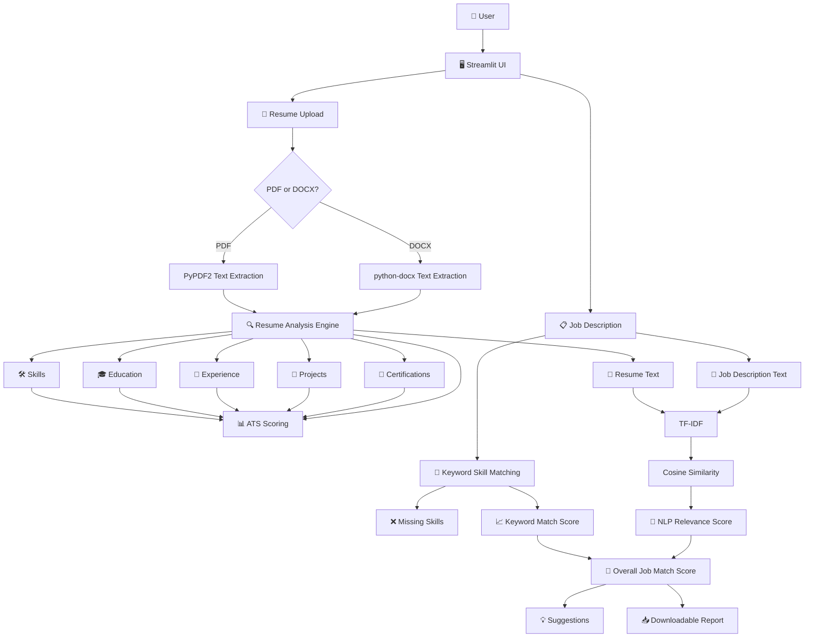
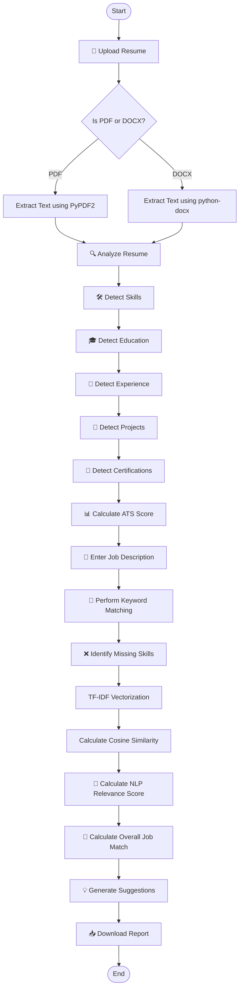

# 🤖 AI Resume Analyzer

### An intelligent resume analysis and job matching web application built with **Python & Streamlit**.

[](https://www.python.org/)
[](https://streamlit.io/)
[](https://scikit-learn.org/)
[](https://pypi.org/project/PyPDF2/)
[](https://pypi.org/project/python-docx/)
[](https://pandas.pydata.org/)

---

## 📑 Table of Contents

* [Overview](#-overview)
* [Features](#-features)
* [Tech Stack & Tools](#️-tech-stack--tools)
* [Architecture](#️-architecture)
* [Workflow / System Flow](#-workflow--system-flow)
* [Scoring Methodology](#-scoring-methodology)
* [Project Structure](#-project-structure)
* [Getting Started](#-getting-started)
* [Usage](#-usage)
* [Future Enhancements](#-future-enhancements)
* [Contributing](#-contributing)

---

## 🔎 Overview

**AI Resume Analyzer** is a Python-based web application designed to help users understand and improve their resumes for specific job opportunities.

The application allows users to:

* Upload **PDF or DOCX** resumes.
* Automatically extract resume text.
* Detect important career information such as skills, education, experience, projects, and certifications.
* Calculate a **rule-based ATS Resume Score**.
* Compare a resume against a provided Job Description.
* Identify matching and missing skills.
* Calculate an NLP-based relevance score using **TF-IDF and cosine similarity**.
* Generate an overall job match estimate.
* Receive actionable resume improvement suggestions.
* Download the analysis as a text report.

> ⚠️ **Important:** The ATS and job match scores are automated estimates based on the application's analysis rules and NLP methods. They are **not actual recruiter decisions, hiring predictions, or guarantees of job selection**.

---

## ✨ Features

* **📄 Resume Upload** — Upload resumes in PDF or DOCX format directly through the Streamlit interface.
* **📝 Text Extraction** — Extract readable text from uploaded PDF and DOCX documents.
* **🛠️ Skill Detection** — Identify relevant skills mentioned within the resume.
* **🎓 Education Detection** — Detect education-related information from resume content.
* **💼 Experience Detection** — Identify experience-related information.
* **📂 Project Detection** — Detect project-related content and information.
* **📜 Certification Detection** — Identify certification-related information.
* **📊 ATS Resume Scoring** — Calculate a rule-based resume readiness score using multiple resume characteristics.
* **🎯 Job Description Matching** — Compare resume content with a user-provided Job Description.
* **🧠 NLP Relevance Analysis** — Use TF-IDF and cosine similarity to estimate textual relevance between a resume and Job Description.
* **❌ Missing Skill Detection** — Identify required skills from the Job Description that are not detected in the resume.
* **💡 Resume Improvement Suggestions** — Generate suggestions based on the detected resume information and analysis results.
* **📥 Downloadable Analysis Report** — Download the generated analysis as a text report.
* **📊 Professional Dashboard** — Present resume insights, scores, matching skills, missing skills, and suggestions through a dashboard-style Streamlit interface.

---

## 🛠️ Tech Stack & Tools

| Technology            | Layer                  | Purpose                                                                                         |
| --------------------- | ---------------------- | ----------------------------------------------------------------------------------------------- |
| **Python**            | Application Logic      | Core programming language used to build the application and analysis logic.                     |
| **Streamlit**         | Frontend / UI          | Provides the interactive web interface and dashboard.                                           |
| **PyPDF2**            | Document Processing    | Extracts text from uploaded PDF resumes.                                                        |
| **python-docx**       | Document Processing    | Extracts text from uploaded DOCX resumes.                                                       |
| **scikit-learn**      | Machine Learning / NLP | Provides the TF-IDF vectorization and cosine similarity functionality.                          |
| **TF-IDF**            | NLP                    | Converts resume and Job Description text into numerical representations for relevance analysis. |
| **Cosine Similarity** | NLP                    | Measures the similarity between resume content and Job Description content.                     |
| **pandas**            | Data Processing        | Supports structured data handling and analysis within the application.                          |

### 🚫 Technologies intentionally not used

This project currently does **not** use:

* ❌ Database
* ❌ Authentication system
* ❌ External APIs
* ❌ Docker
* ❌ React
* ❌ Node.js
* ❌ Next.js

The current application runs as a **local Streamlit application**.

---

## 🏗️ Architecture

The application consists of a Streamlit user interface, document extraction layer, resume analysis logic, rule-based scoring, keyword matching, and NLP-based relevance analysis.



---

## 🔄 Workflow / System Flow

The complete application workflow is:



---

## 📊 Scoring Methodology

The application uses two different scoring approaches: **rule-based ATS analysis** and **NLP-based job relevance analysis**.

### 📋 ATS Resume Score

The ATS Resume Score is a **rule-based resume readiness estimate**.

The score considers factors including:

| Factor                         | Considered |
| ------------------------------ | ---------- |
| Resume text length             | ✅          |
| Number of detected skills      | ✅          |
| Education information          | ✅          |
| Experience-related information | ✅          |
| Projects                       | ✅          |
| Certifications                 | ✅          |

The resulting score is intended to provide an automated indication of how comprehensively the resume covers these areas.

> **Note:** The ATS score is not an actual ATS platform score and does not represent a recruiter's evaluation.

---

### 🎯 Overall Job Match Score

The Overall Job Match Score combines two components:

| Component              |   Weight |
| ---------------------- | -------: |
| 🔑 Keyword Skill Match |  **60%** |
| 🧠 NLP Relevance Score |  **40%** |
| **Overall Job Match**  | **100%** |

Conceptually:

```text
Overall Job Match Score
        =
(Keyword Skill Match × 0.60)
        +
(NLP Relevance Score × 0.40)
```

---

### 🔑 Keyword Skill Matching

The application identifies skills from the provided Job Description and compares them against the skills detected in the uploaded resume.

This produces:

* Matching skills
* Missing skills
* Keyword Match Score

This approach focuses specifically on the presence of relevant skills.

---

### 🧠 NLP Relevance — TF-IDF + Cosine Similarity

The application also compares the textual content of the resume and Job Description.

The process is:

```text
Resume Text
     +
Job Description
     ↓
TF-IDF Vectorization
     ↓
Numerical Text Representations
     ↓
Cosine Similarity
     ↓
NLP Relevance Score
```

**TF-IDF** helps represent the importance of terms within the text, while **cosine similarity** estimates how closely the resume content relates to the Job Description.

---

## 📁 Project Structure

```text
AI-Resume-Analyzer/
│
├── 📄 app.py
├── 📄 requirements.txt
├── 📄 .gitignore
└── 📁 venv/
```

### 📌 File Description

| File / Directory   | Description                                                                     |
| ------------------ | ------------------------------------------------------------------------------- |
| `app.py`           | Main Streamlit application containing the user interface and application logic. |
| `requirements.txt` | Lists the Python packages required to run the application.                      |
| `.gitignore`       | Prevents local and unnecessary files from being tracked by Git.                 |
| `venv/`            | Local Python virtual environment. **Must not be uploaded to GitHub.**           |

### `.gitignore`

The project ignores:

```gitignore
venv/
__pycache__/
*.pyc
.streamlit/
.env
```

> 🔒 The `venv/` directory is environment-specific and should remain local.

---

## 🚀 Getting Started

### 📋 Prerequisites

Before running the project, make sure you have:

* 🐍 **Python 3.13 or compatible Python 3.x**
* 💻 **VS Code** or another code editor
* 🌐 **Git** — optional, but recommended for GitHub

---

### 1️⃣ Clone the Repository

Replace the placeholder with your actual GitHub repository URL.

```bash
git clone <YOUR_GITHUB_REPOSITORY_URL>
cd AI-Resume-Analyzer
```

---

### 2️⃣ Create a Virtual Environment

```bash
python -m venv venv
```

---

### 3️⃣ Activate the Virtual Environment

#### Windows

```bash
venv\Scripts\activate
```

#### macOS / Linux

```bash
source venv/bin/activate
```

---

### 4️⃣ Install Dependencies

Install the packages listed in `requirements.txt`:

```bash
pip install -r requirements.txt
```

The current requirements are:

```text
streamlit
PyPDF2
python-docx
scikit-learn
pandas
```

---

### 5️⃣ Run the Streamlit Application

```bash
streamlit run app.py
```

Streamlit will start the local application and provide a local URL in the terminal.

---

## 💻 Usage

### Step 1 — Launch the Application

Run:

```bash
streamlit run app.py
```

Open the local Streamlit application in your browser.

---

### Step 2 — Upload Your Resume

Upload a resume in either:

```text
📄 PDF
📄 DOCX
```

The application extracts the text automatically.

---

### Step 3 — Review Resume Information

The application analyzes the extracted content and detects:

* 🛠️ Skills
* 🎓 Education
* 💼 Experience
* 📂 Projects
* 📜 Certifications

A resume text preview is also provided.

---

### Step 4 — Check ATS Resume Score

The application calculates a rule-based **ATS Resume Score** based on the available resume information.

The dashboard presents the score through the Streamlit interface.

---

### Step 5 — Enter a Job Description

Paste the Job Description you want to compare against your resume.

The application analyzes the requirements and identifies relevant skills.

---

### Step 6 — Review Job Matching Results

The application provides:

* 🔑 Matching skills
* ❌ Missing skills
* 📊 Keyword Match Score
* 🧠 NLP Relevance Score
* 🎯 Overall Job Match Score

---

### Step 7 — Review Suggestions

Use the generated improvement suggestions to identify areas where the resume can potentially be strengthened.

---

### Step 8 — Download the Analysis

Use the **Download Report** functionality to save the resume analysis as a text report.

---

## 🔮 Future Enhancements

The current implementation focuses on resume analysis and job matching using rule-based logic and NLP techniques.

Potential future improvements include:

* 📌 More advanced resume section detection.
* 🧩 Improved skill extraction and normalization.
* 📈 More detailed scoring breakdowns.
* 📝 Additional resume improvement recommendations.
* 📊 Expanded dashboard visualizations.
* 📄 Support for additional document formats.
* 🎯 More sophisticated job-to-resume matching techniques.
* 🔍 Improved handling of different resume structures and formats.

> These are potential future improvements and are **not part of the current implementation**.

---

## 🤝 Contributing

Contributions and suggestions are welcome.

### Contribution Workflow

```bash
# 1. Fork the repository

# 2. Clone your fork
git clone <YOUR_FORKED_REPOSITORY_URL>

# 3. Create a feature branch
git checkout -b feature/your-feature-name

# 4. Make your changes

# 5. Commit your changes
git add .
git commit -m "Add your feature"

# 6. Push the branch
git push origin feature/your-feature-name

# 7. Open a Pull Request
```

### Contribution Guidelines

* Keep changes focused and relevant.
* Do not commit the `venv/` directory.
* Keep `requirements.txt` updated when dependencies change.
* Avoid adding technologies or services that are not required.
* Test the Streamlit application before submitting changes.
* Write clear and meaningful commit messages.

---

## 📌 Project Summary

| Category                | Details                                        |
| ----------------------- | ---------------------------------------------- |
| **Project**             | AI Resume Analyzer                             |
| **Type**                | Resume Analysis & Job Matching Web Application |
| **Language**            | Python                                         |
| **Frontend**            | Streamlit                                      |
| **Document Processing** | PyPDF2, python-docx                            |
| **NLP**                 | TF-IDF, Cosine Similarity                      |
| **Data Processing**     | pandas                                         |
| **Database**            | None                                           |
| **Authentication**      | None                                           |
| **External APIs**       | None                                           |
| **Deployment**          | Local Streamlit Application                    |
| **ATS Method**          | Rule-based resume readiness estimate           |
| **Job Matching**        | 60% Keyword Matching + 40% NLP Relevance       |

---

## ⭐ Why This Project?

**AI Resume Analyzer** demonstrates the practical application of:

* 🐍 Python programming
* 🌐 Streamlit web application development
* 📄 Document text extraction
* 🧠 Natural Language Processing
* 📊 Rule-based scoring
* 🔎 Keyword-based information matching
* 📐 TF-IDF vectorization
* 📈 Cosine similarity
* 💻 Interactive dashboard development

It is designed as a **portfolio and learning project** demonstrating how Python and NLP techniques can be combined to build a useful resume analysis application.

---

### 👩‍💻 Built with Python & Streamlit

**AI Resume Analyzer** — making resume analysis more structured, understandable, and actionable.
