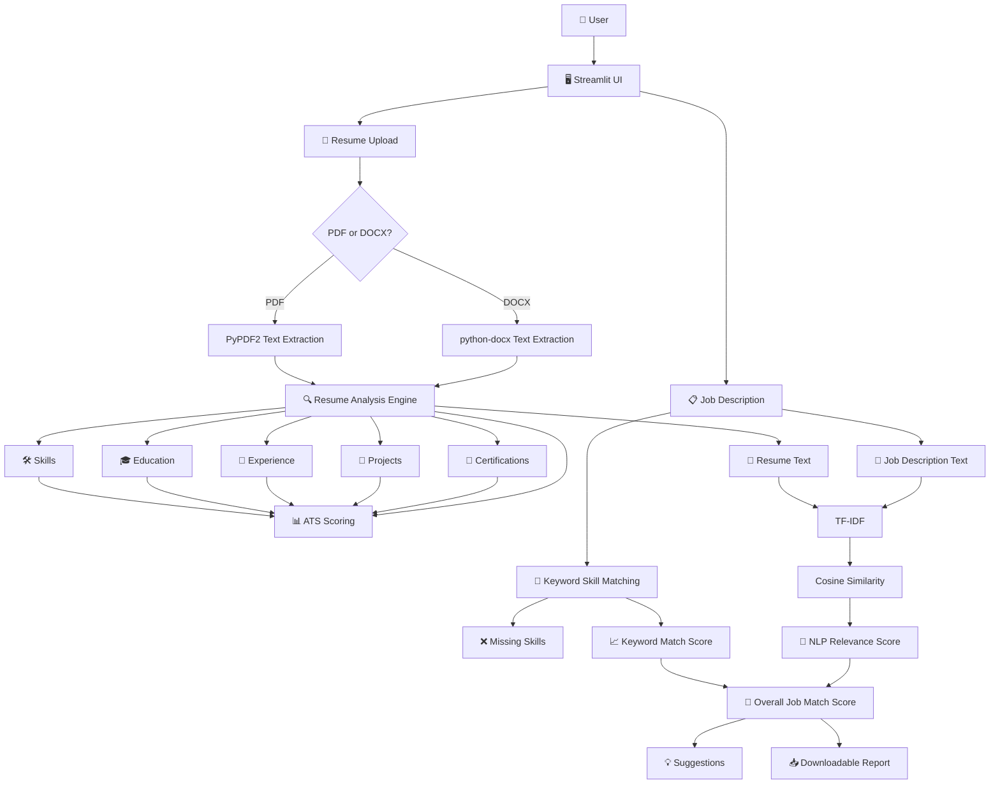
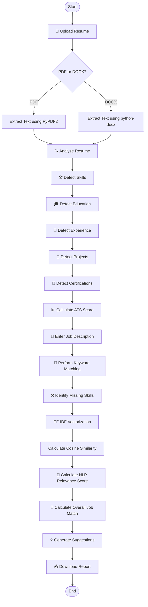
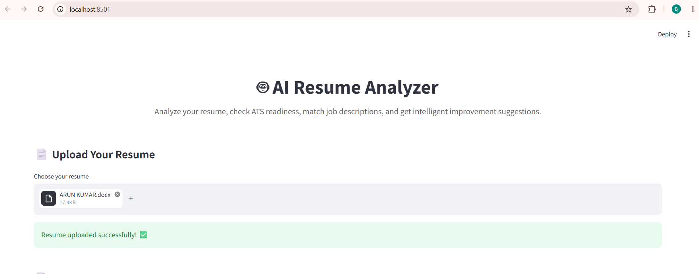
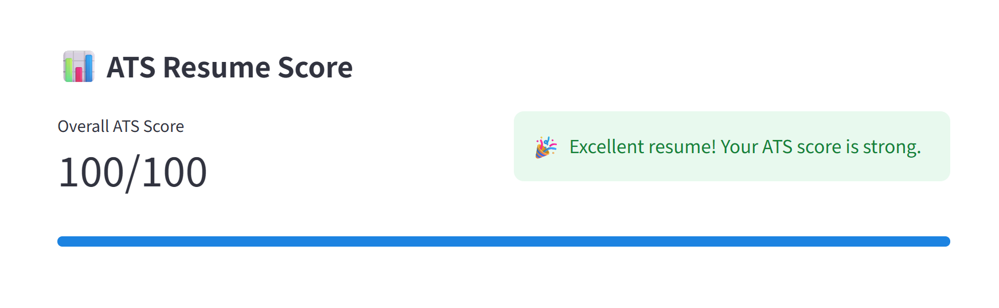
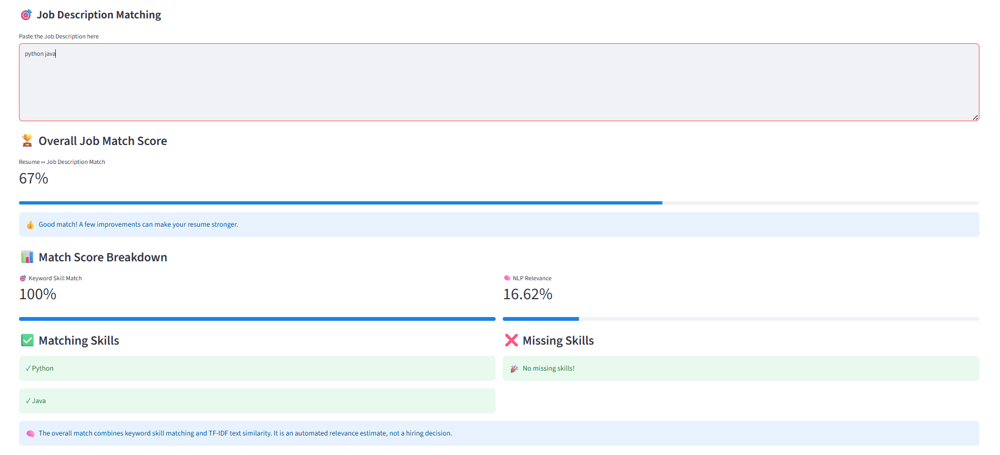

# 🤖 AI Resume Analyzer

### An intelligent resume analysis and job matching web application built with **Python & Streamlit**.

[](https://www.python.org/)
[](https://streamlit.io/)
[](https://scikit-learn.org/)
[](https://pypi.org/project/PyPDF2/)
[](https://pypi.org/project/python-docx/)
[](https://pandas.pydata.org/)

---

## 🌐 Live Demo

🚀 **[Try AI Resume Analyzer](https://dharunya-ai-resume-2609.streamlit.app/)**

The application is deployed using **Streamlit Community Cloud** and can be accessed directly through a web browser.

---

## 📑 Table of Contents

* [Overview](#-overview)
* [Features](#-features)
* [Tech Stack & Tools](#️-tech-stack--tools)
* [Architecture](#️-architecture)
* [Workflow / System Flow](#-workflow--system-flow)
* [Screenshots](#-screenshots)
* [Scoring Methodology](#-scoring-methodology)
* [Project Structure](#-project-structure)
* [Getting Started](#-getting-started)
* [Usage](#-usage)
* [Deployment](#️-deployment)
* [Future Enhancements](#-future-enhancements)
* [Contributing](#-contributing)
* [Project Summary](#-project-summary)

---

## 🔎 Overview

**AI Resume Analyzer** is a Python-based web application designed to help users understand and improve their resumes for specific job opportunities.

The application allows users to:

* 📄 Upload **PDF or DOCX** resumes.
* 📝 Automatically extract resume text.
* 🛠️ Detect important skills.
* 🎓 Identify education information.
* 💼 Detect experience-related information.
* 📂 Identify project information.
* 📜 Detect certifications and courses.
* 📊 Calculate a **rule-based ATS Resume Score**.
* 🎯 Compare resumes against a provided Job Description.
* 🔎 Identify matching and missing skills.
* 🧠 Calculate NLP-based relevance using **TF-IDF and cosine similarity**.
* 📈 Generate an overall job match estimate.
* 💡 Provide actionable resume improvement suggestions.
* 📥 Download the analysis as a text report.

> ⚠️ **Important:** The ATS and job match scores are automated estimates based on the application's analysis rules and NLP methods. They are **not actual recruiter decisions, hiring predictions, or guarantees of job selection**.

---

## ✨ Features

### 📄 Resume Analysis

* Upload PDF and DOCX resumes.
* Automatically extract resume text.
* Display extracted resume content.
* Analyze important resume sections.

### 🛠️ Information Detection

* Detect technical and soft skills.
* Identify education information.
* Detect experience-related information.
* Identify projects.
* Detect certifications and courses.

### 📊 ATS Resume Analysis

* Calculate a rule-based ATS Resume Score.
* Evaluate resume completeness.
* Analyze important resume characteristics.
* Provide improvement suggestions.

### 🎯 Job Description Matching

* Enter a custom Job Description.
* Compare resume skills against job requirements.
* Identify matching skills.
* Identify missing skills.
* Calculate a keyword-based match score.

### 🧠 NLP Analysis

* TF-IDF vectorization.
* Cosine similarity.
* Resume and Job Description relevance analysis.
* NLP-based relevance score.

### 💡 Resume Improvement

* Generate actionable suggestions.
* Identify areas that may require improvement.
* Help users optimize their resume for specific job opportunities.

### 📥 Download Report

* Generate an analysis report.
* Download the results as a text file.

### 📊 Interactive Dashboard

The Streamlit interface presents:

* Resume information
* Detected skills
* Education
* Experience
* Projects
* Certifications
* ATS Score
* Job Match Score
* Matching Skills
* Missing Skills
* Improvement Suggestions

---

## 🛠️ Tech Stack & Tools

| Technology                    | Layer                  | Purpose                                    |
| ----------------------------- | ---------------------- | ------------------------------------------ |
| **Python**                    | Application Logic      | Core programming language                  |
| **Streamlit**                 | Frontend / UI          | Interactive web interface and dashboard    |
| **PyPDF2**                    | Document Processing    | PDF text extraction                        |
| **python-docx**               | Document Processing    | DOCX text extraction                       |
| **scikit-learn**              | Machine Learning / NLP | TF-IDF and cosine similarity               |
| **TF-IDF**                    | NLP                    | Text representation and relevance analysis |
| **Cosine Similarity**         | NLP                    | Measures textual similarity                |
| **pandas**                    | Data Processing        | Structured data handling                   |
| **GitHub**                    | Version Control        | Source code management                     |
| **Streamlit Community Cloud** | Deployment             | Web application deployment                 |

### 🚫 Technologies Not Used

This project currently does **not** use:

* ❌ Database
* ❌ Authentication system
* ❌ External APIs
* ❌ Docker
* ❌ React
* ❌ Node.js
* ❌ Next.js

The application is built using **Python and Streamlit**.

---

## 🏗️ Architecture

The application consists of a Streamlit user interface, document extraction layer, resume analysis engine, rule-based scoring, keyword matching, and NLP-based relevance analysis.



---

## 🔄 Workflow / System Flow

The complete application workflow is:



---

## 📸 Screenshots

### 🏠 Resume Upload & Dashboard



---

### 📊 ATS Resume Score



---

### 🔍 Resume Analysis



---

## 📊 Scoring Methodology

The application uses two main scoring approaches:

1. **Rule-based ATS Resume Analysis**
2. **NLP-based Job Relevance Analysis**

---

### 📋 ATS Resume Score

The ATS Resume Score is a **rule-based resume readiness estimate**.

The score considers factors such as:

| Factor                         | Considered |
| ------------------------------ | ---------- |
| Resume text length             | ✅          |
| Number of detected skills      | ✅          |
| Education information          | ✅          |
| Experience-related information | ✅          |
| Projects                       | ✅          |
| Certifications                 | ✅          |

The resulting score provides an automated indication of how comprehensively the resume covers important areas.

> ⚠️ **Note:** This is not an actual ATS platform score and does not represent a recruiter's evaluation.

---

### 🎯 Overall Job Match Score

The Overall Job Match Score combines two components:

| Component              |   Weight |
| ---------------------- | -------: |
| 🔑 Keyword Skill Match |  **60%** |
| 🧠 NLP Relevance Score |  **40%** |
| 🎯 Overall Job Match   | **100%** |

Conceptually:

```text
Overall Job Match Score
        =
(Keyword Skill Match × 0.60)
        +
(NLP Relevance Score × 0.40)
```

---

### 🔑 Keyword Skill Matching

The application identifies relevant skills from the provided Job Description and compares them against skills detected in the uploaded resume.

The analysis provides:

* ✅ Matching skills
* ❌ Missing skills
* 📊 Keyword Match Score

---

### 🧠 NLP Relevance — TF-IDF + Cosine Similarity

The application also compares the textual content of the resume and Job Description.

```text
Resume Text
     +
Job Description
     ↓
TF-IDF Vectorization
     ↓
Numerical Text Representations
     ↓
Cosine Similarity
     ↓
NLP Relevance Score
```

**TF-IDF** represents the importance of terms within the text, while **cosine similarity** estimates how closely the resume content relates to the Job Description.

---

## 📁 Project Structure

```text
AI-Resume-Analyzer/
│
├── 📁 Screenshots/
│   ├── 01-resume-upload-dashboard.png
│   ├── 02-ats-score.png
│   └── 03-resume-analysis.png
│
├── 📄 app.py
├── 📄 requirements.txt
├── 📄 .gitignore
└── 📄 README.md
```

### 📌 File Description

| File / Directory   | Description                                                            |
| ------------------ | ---------------------------------------------------------------------- |
| `app.py`           | Main Streamlit application containing the interface and analysis logic |
| `requirements.txt` | Python packages required to run the application                        |
| `.gitignore`       | Prevents unnecessary and environment-specific files from being tracked |
| `README.md`        | Project documentation                                                  |
| `Screenshots/`     | Contains screenshots demonstrating the application interface           |

### `.gitignore`

The project ignores:

```gitignore
venv/
__pycache__/
*.pyc
.streamlit/
.env
```

> 🔒 The `venv/` directory is environment-specific and should remain local.

---

## 🚀 Getting Started

### 📋 Prerequisites

Before running the project, make sure you have:

* 🐍 **Python 3.13 or compatible Python 3.x**
* 💻 **VS Code** or another code editor
* 🌐 **Git** — recommended for version control

---

### 1️⃣ Clone the Repository

```bash
git clone https://github.com/kittyyash/AI-Resume-Analyzer.git
cd AI-Resume-Analyzer
```

---

### 2️⃣ Create a Virtual Environment

```bash
python -m venv venv
```

---

### 3️⃣ Activate the Virtual Environment

#### Windows

```bash
venv\Scripts\activate
```

#### macOS / Linux

```bash
source venv/bin/activate
```

---

### 4️⃣ Install Dependencies

```bash
pip install -r requirements.txt
```

---

### 5️⃣ Run the Application

```bash
streamlit run app.py
```

The application will start locally and provide a URL in the terminal.

---

## 💻 Usage

### Step 1 — Launch the Application

Run:

```bash
streamlit run app.py
```

Open the Streamlit URL shown in your browser.

### Step 2 — Upload Your Resume

Upload a resume in either:

```text
📄 PDF
📄 DOCX
```

The application extracts the resume text automatically.

### Step 3 — Review Resume Information

The application analyzes the extracted resume and detects:

* 🛠️ Skills
* 🎓 Education
* 💼 Experience
* 📂 Projects
* 📜 Certifications

### Step 4 — Check ATS Resume Score

The application calculates a rule-based **ATS Resume Score** based on the detected resume information.

### Step 5 — Enter a Job Description

Paste the Job Description you want to compare against your resume.

### Step 6 — Review Job Matching Results

The application provides:

* 🔑 Matching Skills
* ❌ Missing Skills
* 📊 Keyword Match Score
* 🧠 NLP Relevance Score
* 🎯 Overall Job Match Score

### Step 7 — Review Suggestions

Review the generated suggestions to identify areas where your resume may be improved.

### Step 8 — Download the Analysis

Use the **Download Report** functionality to save the analysis as a text report.

---

## ☁️ Deployment

The application is deployed using **Streamlit Community Cloud**.

### 🌐 Live Application

🚀 **[Open AI Resume Analyzer](https://dharunya-ai-resume-2609.streamlit.app/)**

The deployed application can be accessed directly through a web browser without requiring Python or VS Code on the user's device.

### 🔗 GitHub Repository

🐙 **[AI Resume Analyzer](https://github.com/kittyyash/AI-Resume-Analyzer)**

---

## 🔮 Future Enhancements

Potential future improvements include:

* 🤖 AI-powered resume recommendations
* 📑 Support for additional resume formats
* 🎨 Improved dashboard UI
* 📊 Advanced resume analytics
* 💼 Job-specific resume optimization
* 🔍 Improved skill extraction
* 📈 More detailed scoring breakdowns
* 🎯 Advanced job-to-resume matching
* 🔐 User authentication
* ☁️ Database integration
* 📊 Advanced dashboard visualizations

> These are potential future improvements and are **not part of the current implementation**.

---

## 🤝 Contributing

Contributions and suggestions are welcome.

### Contribution Workflow

```bash
# Clone the repository
git clone https://github.com/kittyyash/AI-Resume-Analyzer.git

# Create a feature branch
git checkout -b feature/your-feature-name

# Make your changes

# Stage changes
git add .

# Commit changes
git commit -m "Add your feature"

# Push the branch
git push origin feature/your-feature-name
```

Then open a **Pull Request** on GitHub.

### Contribution Guidelines

* Keep changes focused and relevant.
* Do not commit the `venv/` directory.
* Keep `requirements.txt` updated when dependencies change.
* Test the Streamlit application before submitting changes.
* Write clear and meaningful commit messages.

---

## 📌 Project Summary

| Category                | Details                                        |
| ----------------------- | ---------------------------------------------- |
| **Project**             | AI Resume Analyzer                             |
| **Type**                | Resume Analysis & Job Matching Web Application |
| **Language**            | Python                                         |
| **Frontend / UI**       | Streamlit                                      |
| **Document Processing** | PyPDF2, python-docx                            |
| **NLP**                 | TF-IDF, Cosine Similarity                      |
| **Data Processing**     | pandas                                         |
| **Database**            | None                                           |
| **Authentication**      | None                                           |
| **External APIs**       | None                                           |
| **Deployment**          | Streamlit Community Cloud                      |
| **ATS Method**          | Rule-based resume readiness estimate           |
| **Job Matching**        | 60% Keyword Matching + 40% NLP Relevance       |

---

## ⭐ Why This Project?

**AI Resume Analyzer** demonstrates the practical application of:

* 🐍 Python programming
* 🌐 Streamlit web application development
* 📄 Document text extraction
* 🧠 Natural Language Processing
* 📊 Rule-based scoring
* 🔎 Keyword-based matching
* 📐 TF-IDF vectorization
* 📈 Cosine similarity
* 💻 Interactive dashboard development

It is designed as a **portfolio project** demonstrating how Python and NLP techniques can be combined to build a practical resume analysis and job matching application.

---

## 👩‍💻 Author

### **Dharunya**

🔗 **GitHub:** [kittyyash](https://github.com/kittyyash)

🚀 **Live Project:** [AI Resume Analyzer](https://dharunya-ai-resume-2609.streamlit.app/)

---

⭐ **If you find this project useful, consider giving the repository a star!**

### Built with ❤️ using Python & Streamlit
